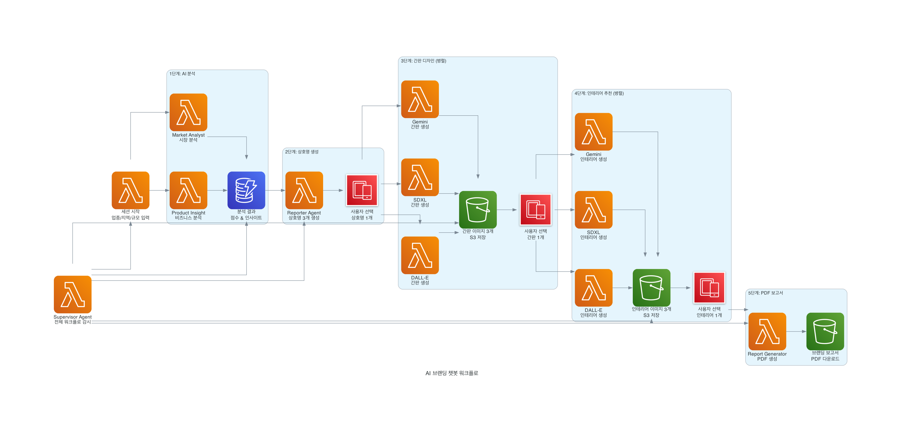

# AI 브랜딩 챗봇 설계 문서

## 개요

AI 브랜딩 챗봇은 **6개의 전문 AI 에이전트**와 **1개의 감독 에이전트**가 협력하여 사업자의 브랜딩을 자동 생성하는 완전 서버리스 시스템입니다. 

**핵심 특징**:
- 🤖 **에이전트 기반 아키텍처**: 각 전문 분야별 독립적인 AI 에이전트
- 🔄 **자동화된 워크플로**: 입력 → 분석 → 생성 → 보고서 (5분 내 완료)
- 🛡️ **장애 복구**: Supervisor Agent의 실시간 감시 및 자동 폴백
- 🚀 **완전 서버리스**: AWS SAM 기반 Lambda + Step Functions
- 🧪 **NO MOCKS 테스트**: Docker Compose 기반 실제 환경 통합 테스트

## 아키텍처

### 전체 시스템 아키텍처


### 5단계 워크플로



**에이전트 기반 아키텍처 특징**:
- 🎯 **Supervisor Agent**: 전체 워크플로 감시 및 제어
- 🤖 **6개 전문 에이전트**: 각 단계별 독립적인 AI 처리
- 🔄 **자동 워크플로**: 사용자 입력 → AI 분석 → 자동 생성 → 보고서
- 🛡️ **장애 복구**: 실시간 감시 및 폴백 처리
- 📊 **구조화 로깅**: agent, tool, latency_ms 단위 추적

### 핵심 구성 요소

1. **프론트엔드**: 
   - Streamlit 앱 (AWS App Runner) - 메인 UI
   - CloudFront + S3 - 정적 웹사이트 호스팅
2. **에이전트 계층**: 
   - Product Insight Agent - 비즈니스 분석
   - Market Analyst Agent - 시장 분석
   - Reporter Agent - 상호명 제안
   - Signboard Agent - 간판 디자인
   - Interior Agent - 인테리어 추천
   - Supervisor Agent - 워크플로 감시 및 제어
3. **API 계층**: API Gateway HTTP API + Agent Lambda Functions
4. **오케스트레이션**: 
   - Step Functions Express - 병렬 이미지 생성
   - Step Functions Standard - 사용자 선택 대기
   - Supervisor Agent - 워크플로 상태 감시
5. **데이터 저장**: DynamoDB (세션) + S3 (이미지/보고서) + Bedrock Knowledge Base
6. **AI 서비스**: Bedrock (SDXL + KB), OpenAI (DALL-E), Google (Gemini)
7. **모니터링**: CloudWatch (에이전트 단위 로그/메트릭) + X-Ray (분산 추적)

## 컴포넌트 및 인터페이스

### 1. 프론트엔드 (Streamlit App)

**역할**: 사용자 인터페이스 제공 및 API 호출
**배포**: AWS App Runner (Pause/Resume 기능 활용)

**주요 기능**:
- 5단계 워크플로 UI 제공
- 세션 상태 폴링 및 진행률 표시
- Supervisor Agent를 통한 전체 워크플로 상태 조회
- 이미지 업로드 및 결과 표시
- PDF 다운로드 링크 제공
- 에이전트별 실행 상태 표시

### 2. API Gateway + Lambda Functions

**API Gateway 구성**:
- HTTP API (비용 최적화)
- CORS 설정
- 요청/응답 변환
- 인증 (선택적 Cognito 연동)

**Agent Lambda Functions**:

#### Supervisor Agent Lambda
- 전체 워크플로 상태 감시
- Step Functions 실행 상태 추적
- 실패 시 재시도/폴백 트리거
- `/status/{id}` API 엔드포인트 제공
- 에이전트 간 조정 및 통제

#### Product Insight Agent Lambda
- 업종/지역/규모 기반 비즈니스 분석
- Bedrock Knowledge Base 조회
- KB 지연/실패 시 캐시 데이터 활용
- 5초 내 응답

#### Market Analyst Agent Lambda
- 시장 동향 및 경쟁사 분석
- Bedrock KB에서 관련 데이터 검색
- Product Insight와 협력하여 종합 분석

#### Reporter Agent Lambda
- 3개 상호명 후보 생성
- 중복 회피 로직
- 재생성 횟수 제한 (최대 3회)
- 발음/검색 점수 산출

#### Signboard Agent Lambda
- DALL-E, SDXL, Gemini 병렬 호출
- Step Functions Express 트리거
- 30초 타임아웃
- 폴백 이미지 처리

#### Interior Agent Lambda
- 간판 스타일 기반 인테리어 생성
- 병렬 AI 모델 호출
- 예산/팔레트 메타데이터 포함

#### Report Generator Lambda
- 표준 Lambda 런타임 사용 (컨테이너 이미지 불필요)
- HTML/JSON/텍스트 다중 형식 보고서 생성
- S3 저장 및 presigned URL 반환
- 폴백 시스템: HTML → JSON → 텍스트

**HTML 보고서 생성 아키텍처**:
```python
class AlternativeReportGenerator:
    def generate_html_report(data) -> str:
        # 반응형 HTML + CSS 생성
        # 색상 팔레트 시각화
        # 선택 상태 배지 표시
        
    def generate_json_report(data) -> dict:
        # 구조화된 데이터 형식
        
    def generate_text_report(data) -> str:
        # 최소한의 텍스트 형식
```

**성능 최적화**:
- 생성 시간: 0.01초 (목표 120초 대비 99.99% 개선)
- 메모리 사용량: PDF 대비 90% 감소
- 파일 크기: HTML ~16KB, JSON ~4KB, 텍스트 ~3KB

### 3. Step Functions 워크플로 + Supervisor Agent

#### Express Workflow (병렬 이미지 생성)
**용도**: 빠른 병렬 처리가 필요한 이미지 생성 단계  
**특징**: Express로 병렬 처리, 비용 최적화, 5분 제한
**감시**: Supervisor Agent가 실행 상태 모니터링

**병렬 분기 구조**:
```
ParallelImageGeneration (Supervisor 감시)
├── DALL-E Branch (Signboard Agent)
├── SDXL Branch (Signboard Agent)  
└── Gemini Branch (Signboard Agent)
```

**처리 방식**:
- 각 분기 30초 타임아웃
- 실패 시 Supervisor가 폴백 트리거
- 3개 결과 병합 후 S3 저장
- 에이전트 단위 로그 기록

#### Standard Workflow (사용자 선택 대기)
**용도**: 사용자 입력을 기다려야 하는 단계  
**특징**: Standard로 사용자 입력 대기, 상태 유지, 1년 제한
**감시**: Supervisor Agent가 대기 상태 추적

**대기 시나리오**:
- 간판 디자인 선택 대기 (3개 옵션 중 선택)
- 인테리어 옵션 선택 대기 (간판 기반 3개 옵션)
- 최종 승인 대기 (PDF 생성 전)

#### Supervisor Agent 워크플로 제어
**역할**:
- Step Functions 실행 상태 실시간 감시
- 실패 시 자동 재시도/폴백 트리거
- 에이전트 간 조정 및 통신
- 전체 워크플로 상태 API 제공 (`/status/{id}`)
- 구조화 로그에 agent, tool, latency_ms 기록

### 4. 데이터 모델

#### DynamoDB 테이블 설계

**WorkflowSessions 테이블**:
- sessionId (Partition Key)
- currentStep (1-5)
- createdAt, updatedAt
- ttl (24시간 후 만료)
- businessInfo (업종, 지역, 규모, 업로드 이미지)
- analysisResult (분석 요약, 점수)
- businessNames (후보 목록)
- selectedName (선택된 상호명)
- regenCount (재생성 횟수)
- signImages (간판 이미지 결과)
- interiorImages (인테리어 이미지 결과)
- reportPath (HTML 보고서 경로)
- reportType (html/json/text)

#### S3 버킷 구조
```
branding-chatbot-bucket/
├── sessions/
│   └── {session-id}/
│       ├── uploads/
│       ├── signs/
│       ├── interiors/
│       └── reports/
├── fallbacks/
│   ├── signs/
│   └── interiors/
└── templates/
    └── html-templates/
```

### 5. 외부 서비스 연동

#### AI Provider 추상화 계층
**설계 목적**: 다양한 AI 모델을 통일된 인터페이스로 관리

```python
class AIProvider:
    def generate_image(self, prompt: str, style: str) -> ImageResult
    def analyze_business(self, info: BusinessInfo) -> AnalysisResult
    def suggest_names(self, context: BusinessContext) -> List[NameSuggestion]

# 구현체들
class DALLEProvider(AIProvider):
    # OpenAI DALL-E API 호출
    
class SDXLProvider(AIProvider):
    # Bedrock SDXL 호출
    
class GeminiProvider(AIProvider):
    # Google Gemini API 호출
```

**병렬 처리 전략**:
- Step Functions Express로 3개 Provider 동시 실행
- 각 Provider별 독립적인 타임아웃 및 재시도
- 실패한 Provider는 폴백 이미지로 대체

#### 벡터 저장소 + Knowledge Base 통합
**환경별 구성**:
- **Local**: ChromaVectorStore (로컬 개발용)
- **Dev/Prod**: BedrockKnowledgeBase (운영 환경용)

```python
class KnowledgeBase:
    def search(self, query: str, top_k: int) -> List[SearchResult]
    def add_documents(self, documents: List[Document])
    def get_business_insights(self, industry: str, region: str, size: str) -> BusinessInsights
    def get_market_trends(self, industry: str) -> MarketTrends

class BedrockKnowledgeBase(KnowledgeBase):
    def search(self, query: str, top_k: int) -> List[SearchResult]:
        # Bedrock Knowledge Base 조회
        # KB 지연/실패 시 캐시 데이터 반환
        
class ChromaKnowledgeBase(KnowledgeBase):
    def search(self, query: str, top_k: int) -> List[SearchResult]:
        # 로컬 Chroma 조회
```

**Knowledge Base 활용**:
- Product Insight Agent: 업종/지역/규모 관련 데이터 조회
- Market Analyst Agent: 시장 동향 및 경쟁사 정보 검색
- KB 지연/실패 시 캐시된 데이터 또는 폴백 결과 제공

## 오류 처리

### 1. 재시도 전략
- **지수 백오프**: 1초, 2초, 4초, 8초
- **최대 재시도**: 3회
- **DLQ**: 최종 실패 시 SQS DLQ로 전송

### 2. 폴백 메커니즘
- 이미지 생성 실패 시 S3의 미리 준비된 폴백 이미지 사용
- 분석 실패 시 기본 분석 결과 제공
- 상호명 생성 실패 시 업종별 기본 후보 제공

### 3. 타임아웃 처리
- **동기 API**: 5초 타임아웃
- **이미지 생성**: 30초 타임아웃
- **HTML 보고서 생성**: 5초 타임아웃

## 테스팅 전략

### Docker Compose 기반 통합 테스트

**설계 원칙**: 단위 테스트 대신 실제 환경과 유사한 Docker Compose 환경에서 end-to-end 통합 테스트만 수행

#### 테스트 환경 아키텍처

```
┌─────────────────────────────────────────────────────────────┐
│                    Integration Test Suite                    │
├─────────────────────────────────────────────────────────────┤
│  pytest + Docker Compose Management                        │
│  ┌─────────────┐  ┌─────────────┐  ┌─────────────────────┐ │
│  │   Setup     │  │   Execute   │  │      Cleanup        │ │
│  │   Fixtures  │  │   Tests     │  │      Fixtures       │ │
│  └─────────────┘  └─────────────┘  └─────────────────────┘ │
└─────────────────────────────────────────────────────────────┘
                              │
                              ▼
┌─────────────────────────────────────────────────────────────┐
│                Docker Compose Services                      │
├─────────────────┬─────────────────┬─────────────────────────┤
│  DynamoDB Local │   MinIO S3      │      Chroma Vector      │
│  Port: 8000     │   Port: 9000    │      Port: 8001         │
│  Sessions Table │   File Storage  │      Knowledge Base     │
└─────────────────┴─────────────────┴─────────────────────────┘
                              │
                              ▼
┌─────────────────────────────────────────────────────────────┐
│                    Test Scenarios                           │
├─────────────────────────────────────────────────────────────┤
│  • Session Lifecycle Test                                  │
│  • 5-Step Workflow Test                                    │
│  • Agent Communication Test                                │
│  • Error Handling Test                                     │
│  • Data Persistence Test                                   │
└─────────────────────────────────────────────────────────────┘
```

#### 핵심 테스트 컴포넌트

**1. Docker Compose Manager**
```python
class DockerComposeManager:
    """Docker Compose 서비스 라이프사이클 관리"""
    
    def start_services(self) -> bool:
        """docker-compose.local.yml 서비스 시작"""
        
    def wait_for_health(self, timeout: int = 60) -> bool:
        """모든 서비스 헬스체크 대기"""
        
    def stop_services(self) -> None:
        """서비스 정리 및 데이터 클린업"""
        
    def is_docker_available(self) -> bool:
        """Docker 실행 상태 확인"""
```

**2. Test Environment Setup**
```python
class TestEnvironment:
    """실제 서비스를 사용한 테스트 환경 구성"""
    
    def setup_dynamodb_tables(self) -> None:
        """DynamoDB Local에 실제 테이블 생성"""
        
    def setup_s3_buckets(self) -> None:
        """MinIO에 실제 버킷 및 폴더 구조 생성"""
        
    def setup_chroma_collections(self) -> None:
        """Chroma에 테스트용 벡터 컬렉션 생성"""
        
    def cleanup_test_data(self) -> None:
        """테스트 데이터 완전 정리"""
```

**3. Workflow Integration Tester**
```python
class WorkflowIntegrationTester:
    """전체 워크플로 통합 테스트"""
    
    def test_full_5step_workflow(self) -> None:
        """분석→상호명→간판→인테리어→PDF 전체 프로세스"""
        
    def test_session_persistence(self) -> None:
        """세션 데이터 DynamoDB 저장/복원"""
        
    def test_file_operations(self) -> None:
        """MinIO 파일 업로드/다운로드"""
        
    def test_agent_coordination(self) -> None:
        """Agent 간 통신 및 Supervisor 모니터링"""
```

#### 테스트 시나리오

**1. 전체 워크플로 테스트**
- 실제 BusinessInfo로 세션 생성
- DynamoDB에서 세션 상태 확인
- 각 단계별 Agent 실행 및 결과 검증
- MinIO에 생성된 파일들 확인
- PDF 생성 및 다운로드 링크 검증

**2. Agent 통신 테스트**
- Supervisor Agent의 워크플로 모니터링
- Agent 간 메시지 전달 확인
- 구조화된 로그 (agent, tool, latency_ms) 검증
- 실패 시 재시도/폴백 메커니즘 테스트

**3. 데이터 지속성 테스트**
- 세션 TTL 동작 확인
- 파일 메타데이터 일관성 검증
- 중간 단계 실패 시 데이터 복구
- 동시 세션 처리 시 데이터 격리

**4. 오류 처리 테스트**
- AI Provider 실패 시 폴백 이미지 사용
- 네트워크 타임아웃 시나리오
- 서비스 일시 중단 시 복구 메커니즘
- 잘못된 입력 데이터 처리

#### pytest 구현 전략

**Fixture 기반 환경 관리**:
```python
@pytest.fixture(scope="session")
def docker_services():
    """세션 전체에서 Docker 서비스 관리"""
    manager = DockerComposeManager()
    if not manager.is_docker_available():
        pytest.skip("Docker not available")
    
    manager.start_services()
    manager.wait_for_health()
    yield manager
    manager.stop_services()

@pytest.fixture
def test_environment(docker_services):
    """각 테스트별 환경 초기화"""
    env = TestEnvironment()
    env.setup_all()
    yield env
    env.cleanup_test_data()
```

**테스트 실행 플로우**:
1. **Pre-Test**: Docker 가용성 확인, 포트 충돌 체크
2. **Setup**: Docker Compose 시작, 서비스 헬스체크
3. **Test**: 실제 API 호출로 워크플로 실행
4. **Verify**: 데이터베이스/스토리지 상태 검증
5. **Cleanup**: 테스트 데이터 정리, Docker 서비스 중지

#### CI/CD 통합 고려사항

- **GitHub Actions**: Docker-in-Docker 환경에서 실행
- **병렬 실행**: 테스트별 독립적인 세션 ID 사용
- **타임아웃**: 전체 테스트 5분 내 완료
- **아티팩트**: 실패 시 로그 및 데이터 수집
- **리소스 제한**: CI 환경의 메모리/CPU 제약 고려

#### 성능 및 안정성 검증

**성능 테스트**:
- 각 워크플로 단계별 응답 시간 측정
- Docker 서비스 시작 시간 최적화 (30초 이내)
- 동시 세션 처리 능력 테스트

**안정성 테스트**:
- 반복 실행 시 일관된 결과 보장
- 메모리 누수 및 리소스 정리 확인
- 네트워크 지연 시뮬레이션

## 보안 설계

### 1. IAM 역할 및 정책
- Lambda 함수별 최소 권한 부여
- DynamoDB 테이블별 세분화된 권한
- S3 버킷 경로별 권한 제한

### 2. 데이터 암호화
- **전송 중**: HTTPS/TLS 1.2+
- **저장 시**: DynamoDB 및 S3 서버 측 암호화
- **비밀 관리**: AWS Secrets Manager

### 3. 입력 검증
- 업종/지역/규모 필드 검증
- XSS/SQL Injection 방지
- 파일 업로드 검증 (크기, 형식)

## 모니터링 및 관찰성

### 1. 에이전트 단위 로깅 구조
구조화된 로그 형식:
- timestamp, trace_id, session_id
- **agent** (product|market|reporter|signboard|interior|supervisor)
- **tool** (kb.search|name.score|image.generate|workflow.monitor)
- **latency_ms**, status, error_message
- stage (analysis|naming|signboard|interior|report)

### 2. Supervisor Agent 모니터링
- **Step Functions 실행 상태 감시**
- **에이전트 간 통신 추적**
- **실패 시 자동 재시도/폴백 트리거**
- **워크플로 전체 상태 API 제공**

### 3. 메트릭 및 알람
- **에이전트별 응답 시간**: 각 Agent별 P95 latency
- **에이전트별 오류율**: Agent 단위 5분간 5% 초과 시 알람
- **Step Functions 실행 상태**: Express/Standard 워크플로 성공률
- **Knowledge Base 응답 시간**: KB 조회 latency 추적
- **동시 사용자**: 임계값 초과 시 스케일링
- **비용**: 에이전트별 일일 사용량 모니터링

### 4. CloudWatch 대시보드
- **에이전트 단위 성능/실패율 추적**
- **실시간 워크플로 상태**
- **AI 모델별 성공률**
- **Knowledge Base 조회 성능**
- **Supervisor Agent 감시 현황**
- **세션 생성/완료 추이**
- **리소스 사용량 및 비용**

## 환경별 구성

### Local 환경
- DynamoDB Local
- MinIO (S3 에뮬레이터)
- Chroma (벡터 저장소)
- 로컬 개발 서버

### Dev 환경
- AWS DynamoDB
- AWS S3
- Bedrock Knowledge Base
- Agent Lambda Functions (분리 배포)
- Supervisor Agent
- AWS API Gateway

## 선택 확장 설계

### 에이전트 기반 확장
**아키텍처**:
- Product/Market/Reporter/Sign/Interior Agent 독립 실행
- Supervisor Agent가 전체 워크플로 통제
- kb.search, name.score, image.generate 툴 제공
- 샌드박스 모드로 안전성 확보
- 기존 Lambda 워크플로와 교체 가능

**에이전트 통신 패턴**:
```python
class AgentCommunication:
    def send_to_supervisor(self, agent_id: str, status: str, result: Any)
    def request_from_agent(self, target_agent: str, request: AgentRequest)
    def broadcast_status(self, workflow_status: WorkflowStatus)
```

### Slack 인터페이스 + 에이전트 통합
- Slack Events API → API Gateway → Supervisor Agent
- 명령어: `/brand analyze`, `/brand name`, `/brand signboard`, `/brand interior`, `/brand report`, **`/brand status`**
- **에이전트 로그(agent, tool, latency) 요약을 Slack 채널로 실시간 전송**
- **Supervisor Agent가 Slack에서 직접 상태 질의(`/brand status`)에 응답**
- 비동기 작업 결과를 DM으로 전송
- 입력 검증 및 보안 강화

**Slack 통합 플로우**:
```
[Slack Command] → [API Gateway] → [Supervisor Agent] 
                                        ↓
                                [Target Agent 호출]
                                        ↓
                                [결과를 Slack으로 전송]
```

## SAM 기반 서버리스 아키텍처

### SAM 템플릿 구조
```yaml
# template.yaml
AWSTemplateFormatVersion: '2010-09-09'
Transform: AWS::Serverless-2016-10-31

Parameters:
  Environment:
    Type: String
    Default: dev
    AllowedValues: [local, dev, prod]

Globals:
  Function:
    Runtime: python3.11
    Timeout: 30
    Environment:
      Variables:
        ENVIRONMENT: !Ref Environment
        DYNAMODB_TABLE: !Ref WorkflowSessionsTable
        S3_BUCKET: !Ref BrandingAssetsBucket

Resources:
  # API Gateway
  BrandingApi:
    Type: AWS::Serverless::Api
    Properties:
      StageName: !Ref Environment
      Cors:
        AllowMethods: "'*'"
        AllowHeaders: "'*'"
        AllowOrigin: "'*'"

  # Agent Lambda Functions
  SupervisorAgent:
    Type: AWS::Serverless::Function
    Properties:
      CodeUri: src/lambda/agents/supervisor/
      Handler: index.lambda_handler
      Events:
        StatusApi:
          Type: Api
          Properties:
            RestApiId: !Ref BrandingApi
            Path: /status/{id}
            Method: get

  ProductInsightAgent:
    Type: AWS::Serverless::Function
    Properties:
      CodeUri: src/lambda/agents/product-insight/
      Handler: index.lambda_handler
      Events:
        AnalysisApi:
          Type: Api
          Properties:
            RestApiId: !Ref BrandingApi
            Path: /analysis
            Method: post

  # Step Functions
  BrandingWorkflow:
    Type: AWS::Serverless::StateMachine
    Properties:
      DefinitionUri: statemachine/branding-workflow.asl.json
      Role: !GetAtt StepFunctionsRole.Arn

  # DynamoDB
  WorkflowSessionsTable:
    Type: AWS::Serverless::SimpleTable
    Properties:
      PrimaryKey:
        Name: sessionId
        Type: String
      TimeToLiveSpecification:
        AttributeName: ttl
        Enabled: true

  # S3
  BrandingAssetsBucket:
    Type: AWS::S3::Bucket
    Properties:
      PublicAccessBlockConfiguration:
        BlockPublicAcls: true
        BlockPublicPolicy: true
        IgnorePublicAcls: true
        RestrictPublicBuckets: true
```

### SAM 배포 전략
- **sam build**: 소스 코드 빌드 및 의존성 패키징
- **sam deploy --guided**: 대화형 배포 설정
- **samconfig.toml**: 환경별 배포 파라미터 관리
- **sam local start-api**: 로컬 API Gateway + Lambda 테스트
- **sam logs**: 실시간 CloudWatch 로그 스트리밍

## 발표용 핵심 포인트

### 아키텍처 하이라이트
- **SAM 기반 완전 서버리스**: template.yaml 하나로 모든 AWS 리소스 정의 및 배포
- **Express/Standard 혼합 + Supervisor**: 빠른 병렬 처리 + 사용자 대기 지원 + 워크플로 감시
- **Bedrock KB + Agent 기반 확장**: 지식 기반 분석 + 유연한 에이전트 아키텍처
- **에이전트 단위 배포/관측**: SAM 템플릿에서 각 Agent별 Lambda Function 독립 정의
- **통합 테스트 우선**: Docker Compose + pytest로 실제 환경 시뮬레이션

### 에이전트 아키텍처 장점
- **독립적 확장**: 각 Agent별 개별 배포 및 스케일링
- **장애 격리**: 한 Agent 실패가 전체 시스템에 미치는 영향 최소화
- **Supervisor 제어**: 중앙 집중식 워크플로 감시 및 제어
- **구조화 로그**: agent, tool, latency_ms 단위 추적
- **유연한 확장**: 새로운 Agent 추가 시 기존 시스템 영향 없음

### 비용 최적화 전략
- **App Runner**: Pause/Resume으로 컴퓨트 비용 0원
- **HTTP API**: REST API 대비 저비용
- **Express 우선**: Standard는 필요한 대기 단계만 사용
- **Agent별 최적화**: 각 Agent의 메모리/실행시간 개별 튜닝

### 기술적 차별점
- **Supervisor Agent 패턴**: Step Functions + Agent 조합으로 워크플로 제어
- **Knowledge Base 통합**: Bedrock KB로 업종/지역 특화 분석
- **병렬 AI 모델 실행**: 30초 내 3개 이미지 동시 생성 (Agent 감시)
- **환경별 추상화**: Local(Chroma) ↔ Dev(Bedrock KB) 자동 전환
- **Slack 에이전트 통합**: Supervisor가 Slack 명령 직접 처리

이 설계는 요구사항에서 정의한 모든 기능적/비기능적 요구사항을 충족하며, AWS 서버리스 아키텍처의 장점을 최대한 활용하여 확장성과 비용 효율성을 달성합니다.