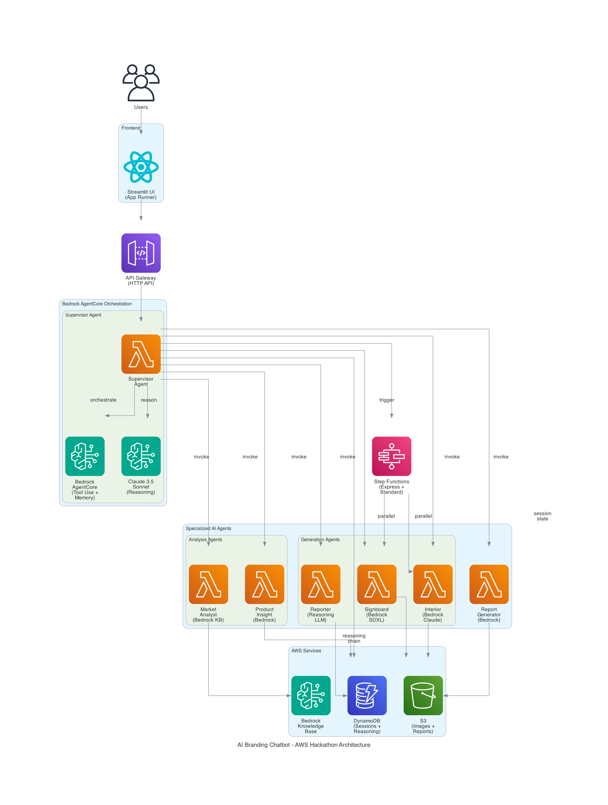
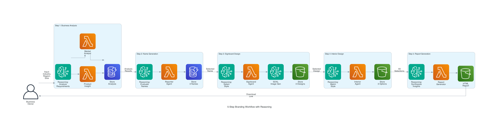
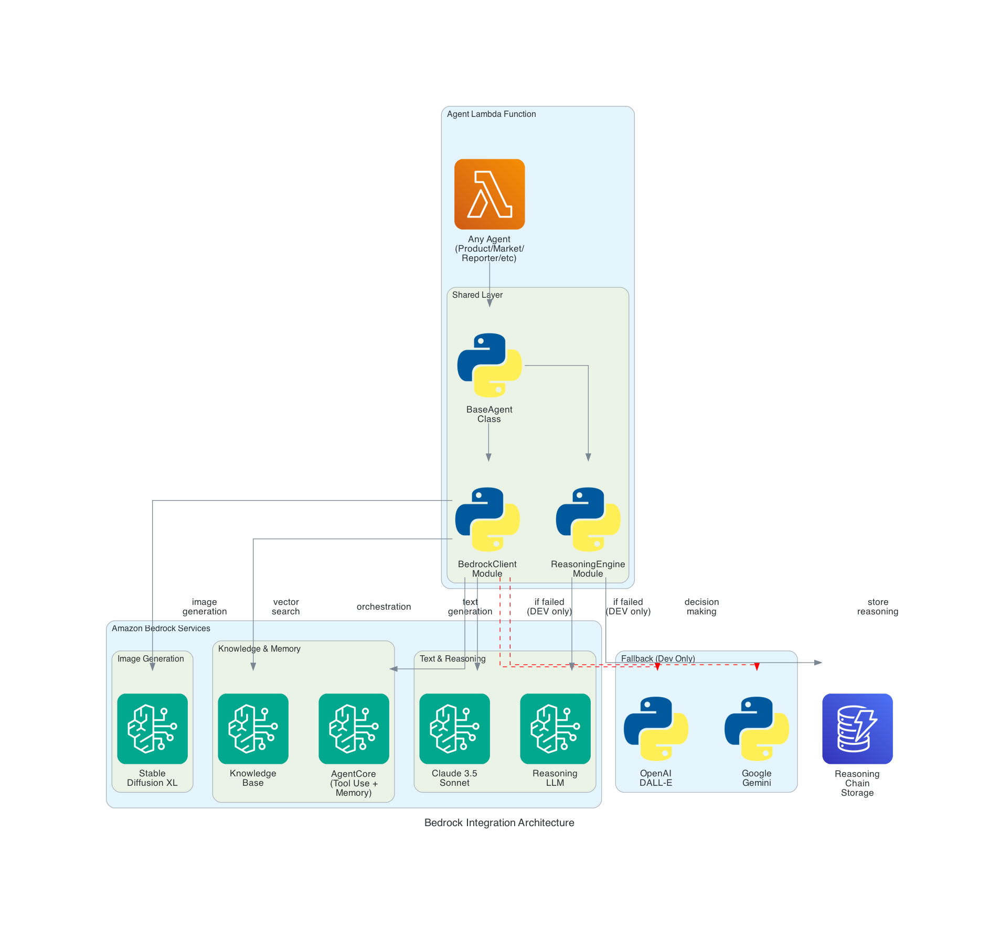

# Design Document

## Overview

이 설계 문서는 기존 AI 브랜딩 챗봇을 AWS AI Agent Global Hackathon 요구사항에 맞춰 수정하는 방법을 정의합니다. 핵심 변경사항은 Amazon Bedrock 통합, Bedrock AgentCore 구현, 그리고 Reasoning LLM 기반 자율 의사결정 시스템 추가입니다.

### Design Principles

1. **Minimal Disruption**: 기존 Agent-Based Architecture 유지하면서 Bedrock 통합
2. **Backward Compatibility**: 로컬 개발 환경은 기존 방식 지원 (OpenAI fallback)
3. **Hackathon Compliance**: 모든 필수 요구사항 충족 (Bedrock, AgentCore, Reasoning LLM)
4. **Production Ready**: 해커톤 이후에도 실제 서비스로 운영 가능한 구조
5. **Well-Architected**: AWS Well-Architected Framework 원칙 준수
6. **Autonomous Execution**: 최소한의 사용자 개입으로 전체 워크플로 자동 실행
7. **Reproducible Deployment**: SAM을 통한 원클릭 배포 지원

## Architecture

### High-Level Architecture



**Key Components**:
- **Frontend**: Streamlit UI on AWS App Runner
- **API Layer**: API Gateway HTTP API (cost-optimized)
- **Orchestration**: Supervisor Agent with Bedrock AgentCore
- **AI Agents**: 6 specialized agents powered by Bedrock
- **Data Layer**: DynamoDB (sessions + reasoning), S3 (assets), Bedrock KB

### 5-Step Branding Workflow



**Workflow Steps**:
1. **Business Analysis**: Product Insight + Market Analyst with Reasoning LLM
2. **Name Generation**: Reporter Agent with name evaluation reasoning
3. **Signboard Design**: Signboard Agent with Bedrock SDXL and style reasoning
4. **Interior Design**: Interior Agent with style matching reasoning
5. **Report Generation**: Report Generator with insight synthesis reasoning

### Bedrock Integration Architecture



**Integration Layers**:
- **Agent Layer**: BaseAgent class with Bedrock integration
- **Bedrock Services**: Claude 4 Sonnet, SDXL, Knowledge Base, AgentCore
- **Reasoning Engine**: Chain-of-Thought decision making with storage
- **Fallback System**: OpenAI/Gemini for development only (dashed lines)

### Key Architectural Changes

1. **Bedrock Integration Layer**: 모든 Agent에 Bedrock 클라이언트 추가
2. **AgentCore Orchestrator**: Supervisor Agent에 AgentCore 통합
3. **Reasoning Engine**: 각 Agent에 Claude 4 Sonnet 기반 reasoning 추가
4. **Fallback System**: Bedrock 실패 시 기존 OpenAI/Gemini로 fallback

## Components and Interfaces

### 1. Bedrock Integration Module

**Location**: `src/lambda/shared/bedrock_client.py`

**Purpose**: Amazon Bedrock API와의 통합을 위한 공통 클라이언트

**Key Methods**:

```python
class BedrockClient:
    """Amazon Bedrock 통합 클라이언트"""
    
    def __init__(self, region: str = "us-west-2"):
        self.bedrock_runtime = boto3.client('bedrock-runtime', region_name=region)
        self.bedrock_agent_runtime = boto3.client('bedrock-agent-runtime', region_name=region)
    
    def invoke_claude(self, prompt: str, system_prompt: str = None, 
                     max_tokens: int = 2048, temperature: float = 0.7) -> dict:
        """Claude 4 Sonnet 호출 (reasoning 및 text generation)"""
        
    def invoke_sdxl(self, prompt: str, negative_prompt: str = None,
                   width: int = 1024, height: int = 1024) -> bytes:
        """Stable Diffusion XL 호출 (image generation)"""
    
    def query_knowledge_base(self, query: str, kb_id: str) -> list:
        """Bedrock Knowledge Base 쿼리 (vector search)"""
    
    def invoke_with_retry(self, func, max_retries: int = 3) -> Any:
        """Exponential backoff를 사용한 재시도 로직"""
```

**Error Handling**:
- `ThrottlingException`: Exponential backoff으로 재시도
- `ValidationException`: 입력 파라미터 검증 및 로깅
- `ServiceUnavailableException`: Fallback provider로 전환

### 2. Bedrock AgentCore Integration

**Location**: `src/lambda/agents/supervisor/agentcore_orchestrator.py`

**Purpose**: Bedrock AgentCore를 사용한 Agent 오케스트레이션

**AgentCore Primitives Used**:
1. **Tool Use**: Agent 간 통신 및 작업 위임
2. **Memory**: 워크플로 상태 및 컨텍스트 유지
3. **Planning**: 다음 실행할 Agent 결정

**Implementation**:
```python
class AgentCoreOrchestrator:
    """Bedrock AgentCore 기반 Supervisor"""
    
    def __init__(self):
        self.bedrock_client = BedrockClient()
        self.agent_id = os.getenv('BEDROCK_AGENT_ID')
        self.agent_alias_id = os.getenv('BEDROCK_AGENT_ALIAS_ID')
    
    def orchestrate_workflow(self, session_id: str, business_info: dict) -> dict:
        """AgentCore를 사용한 워크플로 오케스트레이션"""
        # 1. Reasoning: 워크플로 계획 수립
        # 2. Tool Use: 각 Agent 호출
        # 3. Memory: 진행 상태 저장
        # 4. Decision: 다음 단계 결정
        
    def invoke_agent_with_tool(self, agent_name: str, input_data: dict) -> dict:
        """AgentCore Tool Use primitive로 Agent 호출"""

    def store_workflow_memory(self, session_id: str, step: int, data: dict):
        """AgentCore Memory primitive로 상태 저장"""
    
    def reason_next_step(self, current_state: dict) -> str:
        """Reasoning LLM으로 다음 단계 결정"""
```

### 3. Reasoning Engine

**Location**: `src/lambda/shared/reasoning_engine.py`

**Purpose**: Claude 4 Sonnet을 사용한 자율적 의사결정

**Key Features**:
- Chain-of-Thought reasoning
- Multi-step planning
- Confidence scoring
- Explanation generation

**Implementation**:
```python
class ReasoningEngine:
    """Bedrock Claude 기반 Reasoning Engine"""
    
    def __init__(self):
        self.bedrock_client = BedrockClient()
        self.model_id = "us.anthropic.claude-sonnet-4-20250514-v1:0"
    
    def reason_and_decide(self, context: dict, options: list, 
                         decision_criteria: str) -> dict:
        """
        Returns:
        {
            "decision": "selected_option",
            "reasoning": "step-by-step explanation",
            "confidence": 0.85,
            "alternatives": [...]
        }
        """
    
    def evaluate_business_name(self, name: str, business_info: dict) -> dict:
        """상호명 평가 및 점수 산정"""
    
    def rank_designs(self, designs: list, criteria: dict) -> list:
        """디자인 옵션 순위 결정"""
    
    def synthesize_insights(self, agent_outputs: dict) -> str:
        """여러 Agent 결과를 종합하여 인사이트 생성"""
```

### 4. Modified Agent Structure

각 Agent는 다음 구조로 수정됩니다:

```python
class ModernAgent(BaseAgent):
    """Bedrock 통합 Agent 기본 클래스"""
    
    def __init__(self, agent_type: AgentType):
        super().__init__(agent_type)
        self.bedrock_client = BedrockClient()
        self.reasoning_engine = ReasoningEngine()
        self.fallback_enabled = os.getenv('ENABLE_FALLBACK', 'true') == 'true'
    
    def execute_with_reasoning(self, input_data: dict) -> dict:
        """Reasoning LLM을 사용한 작업 실행 (Requirement 3.1-3.5)"""
        try:
            # 1. Analyze input with reasoning
            analysis = self.reasoning_engine.reason_and_decide(
                context=input_data,
                options=self.get_execution_options(),
                decision_criteria=self.get_criteria()
            )
            
            # 2. Execute based on reasoning
            result = self.execute_task(analysis['decision'])
            
            # 3. Store reasoning chain (Requirement 3.6)
            self.store_reasoning(analysis)
            
            return result
        except Exception as e:
            if self.fallback_enabled:
                return self.execute_with_fallback(input_data)
            raise
    
    def autonomous_error_recovery(self, error: Exception, context: dict) -> dict:
        """자율적 오류 복구 (Requirement 4.2)"""
        # Reasoning LLM으로 복구 전략 결정
        recovery_strategy = self.reasoning_engine.reason_and_decide(
            context={
                "error": str(error),
                "error_type": type(error).__name__,
                "context": context,
                "retry_count": context.get('retry_count', 0)
            },
            options=['retry', 'fallback', 'human_intervention'],
            decision_criteria="Select best recovery strategy"
        )
        
        if recovery_strategy['decision'] == 'retry':
            return self.retry_with_backoff(context)
        elif recovery_strategy['decision'] == 'fallback':
            return self.execute_with_fallback(context)
        else:
            return self.request_human_intervention(error, context)
```

### 5. Autonomous Execution System

**Purpose**: 최소한의 사용자 개입으로 전체 워크플로 자동 실행 (Requirement 4)

**Key Features**:

1. **Autonomous Workflow Execution** (Requirement 4.1)
   - 5단계 워크플로 자동 실행
   - 중간 승인 불필요
   - 실시간 상태 업데이트

2. **Intelligent Error Recovery** (Requirement 4.2)
   - Reasoning LLM 기반 복구 전략 결정
   - 자동 재시도 (exponential backoff)
   - Fallback provider 전환
   - 필요 시 휴먼 개입 요청

3. **Autonomous Evaluation** (Requirement 4.3)
   - 여러 옵션 자동 평가 및 순위 결정
   - Confidence scoring 기반 선택
   - 학습된 기준 적용

4. **State Management** (Requirement 4.4)
   - 워크플로 일시 중지/재개
   - 중간 결과 자동 저장
   - 데이터 손실 방지

5. **Human-in-the-Loop** (Requirement 4.5)
   - 낮은 신뢰도 시 휴먼 리뷰 요청
   - 명확한 의사결정 요구사항 제시
   - 이유 설명 제공

**Implementation**:

```python
class AutonomousWorkflowManager:
    """자율적 워크플로 관리"""
    
    def execute_autonomous_workflow(self, session_id: str, business_info: dict) -> dict:
        """전체 워크플로 자율 실행 (Requirement 4.1)"""
        workflow_state = {
            'session_id': session_id,
            'current_step': 1,
            'status': 'running',
            'requires_human_input': False
        }
        
        for step in range(1, 6):
            try:
                # 각 단계 자율 실행
                result = self.execute_step_autonomously(step, workflow_state)
                workflow_state = self.update_state(workflow_state, result)
                
                # 낮은 신뢰도 체크 (Requirement 3.7, 4.5)
                if result.get('confidence', 1.0) < 0.7:
                    workflow_state['requires_human_input'] = True
                    workflow_state['human_input_reason'] = result.get('reasoning')
                    break
                    
            except Exception as e:
                # 자율적 오류 복구 (Requirement 4.2)
                recovery_result = self.autonomous_error_recovery(e, workflow_state)
                if recovery_result['requires_human_input']:
                    workflow_state['requires_human_input'] = True
                    break
        
        return workflow_state
    
    def save_and_resume_workflow(self, session_id: str) -> dict:
        """워크플로 저장 및 재개 (Requirement 4.4)"""
        # DynamoDB에서 상태 복원
        saved_state = self.load_workflow_state(session_id)
        
        # 중단된 지점부터 재개
        return self.execute_autonomous_workflow(
            session_id=session_id,
            business_info=saved_state['business_info']
        )
```

## External Tool and API Integration

**Purpose**: 외부 도구, API, 데이터베이스 통합 시연 (Requirement 5)

### Integration Points

1. **DynamoDB Integration** (Requirement 5.1)
   - **Purpose**: 시장 데이터 및 세션 관리
   - **Tables**: WorkflowSessions, MarketData, IndustryTrends
   - **Operations**: Query, Scan, PutItem, UpdateItem
   - **Usage**: 업종별 트렌드, 지역 multipliers, 세션 상태

2. **Amazon Bedrock SDXL API** (Requirement 5.2)
   - **Purpose**: 간판 이미지 생성
   - **Model**: stability.stable-diffusion-xl-v1
   - **Parameters**: prompt, negative_prompt, width, height
   - **Integration**: `bedrock_client.invoke_sdxl()`

3. **S3 API Integration** (Requirement 5.3)
   - **Purpose**: 생성된 자산 저장
   - **Operations**: PutObject, GetObject, GeneratePresignedUrl
   - **Buckets**: branding-assets-{environment}
   - **Usage**: 이미지, PDF 보고서 저장

4. **Pronunciation Scoring API** (Requirement 5.4)
   - **Purpose**: 상호명 발음 평가
   - **Library**: `hangul-romanize` (한글 로마자 변환)
   - **Scoring**: 발음 난이도, 외국인 발음 용이성
   - **Integration**: Reporter Agent

5. **PDF Generation Library** (Requirement 5.5)
   - **Library**: `reportlab` or `weasyprint`
   - **Purpose**: HTML → PDF 변환
   - **Features**: 한글 폰트 지원, 이미지 임베딩
   - **Storage**: S3에 업로드 후 presigned URL 생성

6. **Bedrock Knowledge Base** (Requirement 5.6)
   - **Purpose**: 벡터 검색 (시장 인사이트, 트렌드)
   - **Production**: Bedrock KB with OpenSearch Serverless
   - **Local**: Chroma vector database
   - **Operations**: Retrieve, RetrieveAndGenerate
   - **Usage**: Market Analyst Agent

### Circuit Breaker Pattern (Requirement 5.7)

```python
class CircuitBreaker:
    """API 호출 실패 시 circuit breaker 패턴"""
    
    def __init__(self, failure_threshold: int = 5, timeout: int = 60):
        self.failure_count = 0
        self.failure_threshold = failure_threshold
        self.timeout = timeout
        self.last_failure_time = None
        self.state = 'CLOSED'  # CLOSED, OPEN, HALF_OPEN
    
    def call(self, func, *args, **kwargs):
        """Circuit breaker로 보호된 API 호출"""
        if self.state == 'OPEN':
            if time.time() - self.last_failure_time > self.timeout:
                self.state = 'HALF_OPEN'
            else:
                raise CircuitBreakerOpenError("Circuit breaker is OPEN")
        
        try:
            result = func(*args, **kwargs)
            self.on_success()
            return result
        except Exception as e:
            self.on_failure()
            raise
    
    def on_success(self):
        """성공 시 카운터 리셋"""
        self.failure_count = 0
        self.state = 'CLOSED'
    
    def on_failure(self):
        """실패 시 카운터 증가"""
        self.failure_count += 1
        self.last_failure_time = time.time()
        
        if self.failure_count >= self.failure_threshold:
            self.state = 'OPEN'
```

### Graceful Degradation Strategy

**Bedrock API 실패 시**:
1. Exponential backoff로 재시도 (3회)
2. Fallback provider 사용 (DEV_PROFILE=true 시)
3. 정적 fallback 응답 제공
4. 사용자에게 오류 알림

**DynamoDB 실패 시**:
1. 로컬 캐시 사용
2. 기본값 제공
3. 세션 상태 메모리 저장

**S3 실패 시**:
1. 로컬 파일시스템 저장
2. 다음 업로드 시 재시도
3. 임시 URL 제공

## Data Models

### 1. Workflow Session (Enhanced)

```python
@dataclass
class WorkflowSession:
    sessionId: str
    businessInfo: BusinessInfo
    currentStep: int
    status: str  # 'active', 'paused', 'completed', 'failed'
    createdAt: str
    updatedAt: str
    ttl: int
    
    # New fields for Bedrock integration
    bedrockAgentId: Optional[str] = None
    reasoningChain: List[ReasoningStep] = field(default_factory=list)
    agentCoreMemory: Dict[str, Any] = field(default_factory=dict)
    confidenceScores: Dict[str, float] = field(default_factory=dict)
    
    # Existing fields
    productInsight: Optional[dict] = None
    marketAnalysis: Optional[dict] = None
    nameOptions: Optional[List[dict]] = None
    signboardDesigns: Optional[List[dict]] = None
    interiorOptions: Optional[List[dict]] = None
    reportUrl: Optional[str] = None
```

### 2. Reasoning Step

```python
@dataclass
class ReasoningStep:
    """Reasoning LLM의 의사결정 단계"""
    stepNumber: int
    agentName: str
    timestamp: str
    input: dict
    reasoning: str  # Chain-of-thought explanation
    decision: str
    confidence: float
    alternatives: List[dict]
    executionTime: float
```

### 3. Bedrock Configuration

```python
@dataclass
class BedrockConfig:
    """Bedrock 서비스 설정"""
    region: str = "us-west-2"
    claude_model_id: str = "us.anthropic.claude-sonnet-4-20250514-v1:0"
    sdxl_model_id: str = "stability.stable-diffusion-xl-v1"
    agent_id: Optional[str] = None
    agent_alias_id: Optional[str] = None
    knowledge_base_id: Optional[str] = None
    max_retries: int = 3
    timeout: int = 30
    enable_fallback: bool = True
```

## Error Handling

### Bedrock-Specific Error Handling

```python
class BedrockErrorHandler:
    """Bedrock API 오류 처리"""
    
    @staticmethod
    def handle_bedrock_error(error: Exception, context: dict) -> dict:
        """
        Bedrock 오류 유형별 처리:
        - ThrottlingException: Exponential backoff 재시도
        - ValidationException: 입력 검증 및 수정
        - ModelTimeoutException: 타임아웃 증가 또는 fallback
        - ServiceUnavailableException: Fallback provider 사용
        - AccessDeniedException: IAM 권한 확인 메시지
        """
        
        if isinstance(error, ThrottlingException):
            return retry_with_backoff(context)
        elif isinstance(error, ValidationException):
            return validate_and_retry(context)
        elif isinstance(error, ServiceUnavailableException):
            return use_fallback_provider(context)
        else:
            return create_error_response(error, context)
```

### Fallback Strategy

1. **Primary**: Amazon Bedrock (Claude, SDXL)
2. **Secondary**: OpenAI (GPT-4, DALL-E) - 로컬 개발용
3. **Tertiary**: Google Gemini - 추가 fallback
4. **Final**: Static fallback responses

## Testing Strategy

### Testing Philosophy

**NO MOCKS 정책**: Docker Compose 기반 실제 서비스를 사용한 통합 테스트만 수행 (Requirement 10.1)

### Test Environment

- **DynamoDB Local**: 세션 데이터 저장 (localhost:8000)
- **DynamoDB Admin UI**: 데이터 시각화 (localhost:8002)
- **MinIO**: S3 호환 파일 저장 (localhost:9000/9001)
- **Chroma**: 벡터 데이터베이스 (localhost:8001)

### 1. Bedrock Integration Tests

**Location**: `tests/integration/test_bedrock_integration.py`

**Coverage**: Requirement 10.2

```python
def test_bedrock_claude_invocation():
    """Claude 4 Sonnet 호출 테스트"""
    
def test_bedrock_sdxl_image_generation():
    """SDXL 이미지 생성 테스트"""
    
def test_bedrock_knowledge_base_query():
    """Knowledge Base 쿼리 테스트"""
    
def test_bedrock_error_handling():
    """Bedrock 오류 처리 및 재시도 로직 테스트"""
    
def test_bedrock_response_parsing():
    """Bedrock API 응답 파싱 테스트"""
```

### 2. AgentCore Tests

**Location**: `tests/integration/test_agentcore.py`

**Coverage**: Requirement 10.3

```python
def test_agentcore_orchestration():
    """AgentCore 오케스트레이션 테스트"""
    
def test_agentcore_tool_use():
    """Tool Use primitive 테스트"""
    
def test_agentcore_memory():
    """Memory primitive 테스트"""
    
def test_agentcore_inter_agent_communication():
    """Agent 간 통신 테스트"""
```

### 3. Reasoning Engine Tests

**Location**: `tests/integration/test_reasoning.py`

**Coverage**: Requirement 3.6, 3.7

```python
def test_reasoning_decision_making():
    """Reasoning LLM 의사결정 테스트"""
    
def test_reasoning_confidence_scoring():
    """신뢰도 점수 산정 테스트"""
    
def test_reasoning_chain_storage():
    """Reasoning chain DynamoDB 저장 테스트"""
    
def test_low_confidence_handling():
    """낮은 신뢰도 결과 처리 테스트"""
```

### 4. End-to-End Workflow Tests

**Location**: `tests/integration/test_hackathon_workflow.py`

**Coverage**: Requirement 10.4

```python
def test_full_workflow_with_bedrock():
    """Bedrock을 사용한 전체 5단계 워크플로 테스트"""
    
def test_autonomous_execution():
    """자율적 작업 실행 테스트 (Requirement 4.1)"""
    
def test_fallback_mechanism():
    """Fallback 메커니즘 테스트"""
    
def test_pdf_report_generation():
    """최종 PDF 보고서 생성 검증"""
    
def test_concurrent_sessions():
    """동시 세션 처리 테스트 (Requirement 9.4)"""
```

### 5. Test Execution

**Command**: `./scripts/dev.sh test` (Requirement 10.7)

**Expected Results**:
- All integration tests pass
- Detailed logs provided (Requirement 10.5)
- Coverage reports generated
- CI/CD pipeline integration (Requirement 10.6)

## Deployment Strategy

### Deployment Requirements

**SAM-Based Deployment** (Requirement 7.1, 7.2):
- Infrastructure as Code using `template.yaml`
- One-command deployment: `sam build && sam deploy --guided`
- Automatic resource creation in target AWS account
- CloudWatch dashboards included (Requirement 7.7)

### Phase 1: Bedrock Integration (Week 1)

**Deliverables**:
1. Bedrock 클라이언트 구현 (`bedrock_client.py`)
2. 기존 Agent에 Bedrock 통합 (Primary LLM)
3. Fallback 메커니즘 구현 (개발 환경용)
4. 통합 테스트 작성 (Docker Compose 기반)

**Requirements Coverage**: 1.1-1.7, 10.2

### Phase 2: AgentCore Implementation (Week 1-2)

**Deliverables**:
1. Supervisor Agent에 AgentCore 통합
2. Tool Use primitive 구현 (Agent 간 통신)
3. Memory primitive 구현 (워크플로 상태)
4. AgentCore 테스트

**Requirements Coverage**: 2.1-2.7, 10.3

### Phase 3: Reasoning Engine (Week 2)

**Deliverables**:
1. Reasoning Engine 구현 (`reasoning_engine.py`)
2. 각 Agent에 reasoning 추가
3. Confidence scoring 구현 (0-1 scale)
4. Reasoning chain DynamoDB 저장

**Requirements Coverage**: 3.1-3.7, 4.2, 4.3

### Phase 4: Documentation & Demo (Week 2-3)

**Deliverables**:
1. 아키텍처 다이어그램 작성 (Bedrock, AgentCore 강조)
2. README 업데이트 (배포 가이드, Requirement 6.4)
3. 데모 비디오 제작 (3분, Requirement 8.1-8.7)
4. Agent 문서 작성 (각 Agent 책임 및 모델 사용)

**Requirements Coverage**: 6.1-6.7, 8.1-8.7

### Phase 5: Testing & Submission (Week 3)

**Deliverables**:
1. 전체 통합 테스트 (Requirement 10.4)
2. 성능 최적화 (5분 이내 완료, Requirement 9.3)
3. 문서 최종 검토
4. 해커톤 제출 (GitHub, Devpost, 데모 비디오)

**Requirements Coverage**: 9.1-9.7, 10.1-10.7

### Deployment Verification

**Pre-Deployment Checklist** (Requirement 7.5, 7.6):
- [ ] `ENABLE_FALLBACK=false` 설정
- [ ] Bedrock 모델 가용성 확인
- [ ] AgentCore Agent ID 설정
- [ ] IAM 권한 확인
- [ ] 통합 테스트 통과
- [ ] CloudWatch 대시보드 설정

## Performance Considerations

### Bedrock API Latency

- Claude 4 Sonnet: ~2-3초 (평균)
- SDXL 이미지 생성: ~10-15초 (평균)
- Knowledge Base 쿼리: ~1-2초 (평균)

### Performance Requirements (from Requirements Doc)

- **Text responses**: ≤ 5 seconds (Requirement 9.1)
- **Image generation**: ≤ 30 seconds per image (Requirement 9.2)
- **Full workflow**: ≤ 5 minutes (Requirement 9.3)
- **Concurrent sessions**: ≥ 10 simultaneous sessions (Requirement 9.4)

### Optimization Strategies

1. **Parallel Execution**: Step Functions로 병렬 Agent 실행 (Product Insight + Market Analyst 동시 실행)
2. **Caching**: DynamoDB에 자주 사용되는 결과 캐싱 (시장 데이터, 지역 multipliers)
3. **Batch Processing**: 여러 요청을 배치로 처리
4. **Connection Pooling**: Bedrock 클라이언트 재사용
5. **Lambda Optimization**: 메모리 할당 최적화 (1024MB-2048MB)
6. **HTTP API Gateway**: REST API 대신 HTTP API 사용 (비용 최적화, Requirement 9.7)

## Scalability and Reliability

### Scalability Design (Requirement 9.4, 9.5)

**Lambda Auto-Scaling**:
- Concurrent execution limit: 1000 (default)
- Reserved concurrency per agent: 10
- Automatic scaling based on demand
- Cold start optimization: 1024MB-2048MB memory

**DynamoDB Scaling**:
- On-demand capacity mode (automatic scaling)
- No capacity planning required
- Handles traffic spikes automatically
- TTL for automatic session cleanup (24 hours)

**S3 Scalability**:
- Unlimited storage capacity
- Automatic partitioning
- Lifecycle policies for cost optimization
- Versioning for asset history

**Concurrent Session Support** (Requirement 9.4):
- Target: ≥ 10 simultaneous sessions
- Session isolation via session_id
- No shared state between sessions
- Independent Lambda invocations

### Reliability Design

**Automatic Retry Logic**:
- Bedrock API: Exponential backoff (3 retries)
- DynamoDB: Built-in retry with SDK
- S3: Automatic retry on transient failures
- Step Functions: Automatic retry configuration

**Graceful Degradation**:
- Bedrock failure → Fallback provider (dev only)
- DynamoDB failure → Local cache
- S3 failure → Local filesystem
- Agent failure → Supervisor notification

**Session Persistence** (Requirement 4.4):
- All state saved to DynamoDB
- Workflow resumption from any step
- No data loss on failure
- 24-hour TTL with automatic cleanup

**CloudWatch Alarms** (Requirement 9.6):
- Lambda error rate > 5%
- Bedrock API latency > 10 seconds
- DynamoDB throttling events
- S3 upload failures
- Step Functions execution failures

### Monitoring and Observability

**CloudWatch Metrics**:
- Bedrock API call count
- Bedrock API response time (P50, P95, P99)
- Bedrock API error rate
- AgentCore orchestration success rate
- Reasoning confidence average
- Workflow completion time
- Concurrent session count

**Structured Logging**:
```python
log.info(
    "agent_execution",
    agent=agent_name,
    tool=tool_name,
    latency_ms=latency,
    session_id=session_id,
    reasoning_chain=reasoning_steps,
    confidence=confidence_score
)
```

**CloudWatch Dashboard** (Requirement 7.7):
- Real-time metrics visualization
- Agent performance tracking
- Cost monitoring
- Error rate tracking
- Reasoning confidence trends

## Security Considerations

### IAM Permissions

```yaml
BedrockAccessPolicy:
  Version: '2012-10-17'
  Statement:
    - Effect: Allow
      Action:
        - bedrock:InvokeModel
        - bedrock:InvokeModelWithResponseStream
        - bedrock-agent-runtime:InvokeAgent
        - bedrock-agent-runtime:Retrieve
      Resource:
        - !Sub 'arn:aws:bedrock:${AWS::Region}::foundation-model/*'
        - !Sub 'arn:aws:bedrock:${AWS::Region}:${AWS::AccountId}:agent/*'
        - !Sub 'arn:aws:bedrock:${AWS::Region}:${AWS::AccountId}:knowledge-base/*'
```

### API Key Management

- Bedrock: IAM 역할 기반 인증 (API 키 불필요)
- OpenAI (fallback): AWS Secrets Manager에 저장
- Gemini (fallback): AWS Secrets Manager에 저장

## Monitoring and Observability

### CloudWatch Metrics

- Bedrock API 호출 횟수
- Bedrock API 응답 시간
- Bedrock API 오류율
- AgentCore 오케스트레이션 성공률
- Reasoning confidence 평균 점수

### CloudWatch Logs

- 구조화된 로그 (JSON 형식)
- Reasoning chain 로깅
- Agent 간 통신 로깅
- 오류 스택 트레이스

### CloudWatch Dashboard

```
┌─────────────────────────────────────────────────────────────┐
│  AI Branding Chatbot - Hackathon Dashboard                  │
├─────────────────────────────────────────────────────────────┤
│  Bedrock API Calls (Last Hour)          │  Success Rate     │
│  ████████████████████ 1,234             │  ████████ 98.5%   │
├─────────────────────────────────────────┼───────────────────┤
│  Average Response Time                   │  Active Sessions  │
│  Claude: 2.3s  SDXL: 12.1s              │  42               │
├─────────────────────────────────────────┼───────────────────┤
│  Reasoning Confidence (Avg)              │  Fallback Rate    │
│  ████████████ 0.87                      │  ██ 2.1%          │
└─────────────────────────────────────────────────────────────┘
```

## Cost Estimation

### Bedrock Costs (per workflow execution)

- Claude 4 Sonnet: ~$0.015 (5 invocations)
- SDXL Image Generation: ~$0.12 (3 images)
- Knowledge Base Query: ~$0.002 (2 queries)
- **Total per workflow**: ~$0.14

### Other AWS Costs

- Lambda: ~$0.001
- DynamoDB: ~$0.0001
- S3: ~$0.0001
- API Gateway: ~$0.0001
- **Total per workflow**: ~$0.0013

### Monthly Cost Estimate (1000 workflows)

- Bedrock: $140
- Other AWS Services: $1.30
- **Total**: ~$141.30/month

## Next Steps

1. ✅ Requirements 문서 승인 완료
2. ✅ Design 문서 작성 완료
3. ⏭️ Tasks 문서 작성 (implementation plan)
4. ⏭️ 구현 시작

## References

- [Amazon Bedrock Documentation](https://docs.aws.amazon.com/bedrock/)
- [Bedrock AgentCore Guide](https://docs.aws.amazon.com/bedrock/latest/userguide/agents.html)
- [Claude 4 Sonnet Model Card](https://docs.anthropic.com/claude/docs/models-overview)
- [AWS SAM Documentation](https://docs.aws.amazon.com/serverless-application-model/)
- [AWS Well-Architected Framework](https://aws.amazon.com/architecture/well-architected/)


## Bedrock Model/Region Matrix

| Capability | Default Model | Alt Models (if unavailable) | Default Region | Notes |
|------------|---------------|----------------------------|----------------|-------|
| Reasoning/Text | us.anthropic.claude-sonnet-4-20250514-v1:0 | us.anthropic.claude-3-5-sonnet-20241022-v2:0 | us-west-2 | Claude 4 Sonnet for reasoning |
| Image Generation | stability.stable-diffusion-xl-v1 | amazon.titan-image-generator-v2 (optional) | us-west-2 | Cap: 1024x1024 for demo |
| KB Retrieve | bedrock KB (Retrieve/RetrieveAndGenerate) | — | us-west-2 | Needs KB + data source setup |
| Agent Orchestration | Bedrock Agents (AgentCore) | Step Functions fallback | us-west-2 | Use agent alias in prod |

**Important**: Run `aws bedrock list-foundation-models --region us-west-2` before deployment to verify model availability.

## Enhanced IAM Policy

```yaml
BedrockAccessPolicy:
  Type: AWS::IAM::Policy
  Properties:
    PolicyName: BedrockRuntimeAccess
    PolicyDocument:
      Version: '2012-10-17'
      Statement:
        # Bedrock Model Invocation
        - Effect: Allow
          Action:
            - bedrock:InvokeModel
            - bedrock:InvokeModelWithResponseStream
            - bedrock:ListFoundationModels
          Resource: !Sub 'arn:aws:bedrock:${AWS::Region}::foundation-model/*'
        
        # Bedrock Knowledge Base
        - Effect: Allow
          Action:
            - bedrock:Retrieve
            - bedrock:RetrieveAndGenerate
          Resource: !Sub 'arn:aws:bedrock:${AWS::Region}:${AWS::AccountId}:knowledge-base/*'
        
        # Bedrock Agent Runtime
        - Effect: Allow
          Action:
            - bedrock-agent-runtime:InvokeAgent
          Resource: !Sub 'arn:aws:bedrock:${AWS::Region}:${AWS::AccountId}:agent/*'
        
        # CloudWatch Logging & Metrics
        - Effect: Allow
          Action:
            - logs:CreateLogGroup
            - logs:CreateLogStream
            - logs:PutLogEvents
            - cloudwatch:PutMetricData
          Resource: '*'
        
        # S3 Asset Storage
        - Effect: Allow
          Action:
            - s3:PutObject
            - s3:GetObject
            - s3:ListBucket
          Resource:
            - !Sub 'arn:aws:s3:::${BrandingAssetsBucket}'
            - !Sub 'arn:aws:s3:::${BrandingAssetsBucket}/*'
```

## Fallback Governance

### Environment-Based Fallback Control

```python
# config/fallback_config.py
class FallbackConfig:
    """Fallback 거버넌스 설정"""
    
    @staticmethod
    def is_fallback_enabled() -> bool:
        """
        Fallback 활성화 조건:
        - ENABLE_FALLBACK=true (명시적 활성화)
        - DEV_PROFILE=true (개발 환경)
        - ENVIRONMENT=local (로컬 개발)
        
        제출용 구성: ENABLE_FALLBACK=false (Bedrock Only)
        """
        enable_fallback = os.getenv('ENABLE_FALLBACK', 'false').lower() == 'true'
        dev_profile = os.getenv('DEV_PROFILE', 'false').lower() == 'true'
        environment = os.getenv('ENVIRONMENT', 'prod')
        
        return enable_fallback or dev_profile or environment == 'local'
```

### Deployment Checklist for Hackathon Submission

**README 체크리스트 추가**:

```markdown
## Hackathon Submission Checklist

- [ ] Bedrock Only Mode: `ENABLE_FALLBACK=false` in production
- [ ] Model Availability: Verified with `aws bedrock list-foundation-models`
- [ ] AgentCore Setup: Agent ID and Alias configured
- [ ] Knowledge Base: KB ID and data source configured
- [ ] IAM Permissions: All Bedrock policies attached
- [ ] Cost Monitoring: CloudWatch dashboard configured
- [ ] Demo Video: 3-minute video uploaded to YouTube
- [ ] Architecture Diagram: Shows Bedrock AgentCore integration
- [ ] Public Repository: All code pushed to GitHub
- [ ] Deployment URL: Live API endpoint accessible
```

## Sequence Diagram

### Happy Path: Full Workflow Execution

```
User → Streamlit → API Gateway → Supervisor (AgentCore)
                                      │
                                      ├─ Reasoning: Analyze request & plan workflow
                                      │
                                      ├─ Tool Use: Invoke agents in parallel
                                      │  ├─ Product Insight Agent (Bedrock Claude)
                                      │  ├─ Market Analyst Agent (Bedrock Claude + KB)
                                      │  └─ Reporter Agent (Bedrock Claude)
                                      │
                                      ├─ Memory: Store intermediate results
                                      │
                                      ├─ Tool Use: Sequential execution
                                      │  ├─ Signboard Agent (Bedrock SDXL)
                                      │  └─ Interior Agent (Bedrock Claude)
                                      │
                                      ├─ Tool Use: Generate report
                                      │  └─ Report Generator (Bedrock Claude + S3)
                                      │
                                      └─ Memory: Store final results
                                      
                                      ↓
                                   DynamoDB (Session State)
                                   S3 (Generated Assets)
                                   
                                   ↓
User ← Streamlit ← API Gateway ← Supervisor (Success Response)
```

### Error Path: Failure & Recovery

```
Supervisor (AgentCore)
    │
    ├─ Agent Execution Fails (e.g., Bedrock Throttling)
    │
    ├─ Reasoning: Evaluate failure & decide recovery strategy
    │  ├─ Option 1: Retry with exponential backoff
    │  ├─ Option 2: Use alternative model (e.g., Haiku instead of Sonnet)
    │  ├─ Option 3: Request human intervention
    │  └─ Option 4: Use fallback provider (if DEV_PROFILE=true)
    │
    ├─ Decision: Select best recovery option based on:
    │  - Error type (throttling vs validation vs timeout)
    │  - Retry count (max 3 attempts)
    │  - Confidence score (>0.7 for auto-retry)
    │  - User preference (allow human review)
    │
    └─ Execute Recovery & Continue Workflow
```

## Risk Mitigation

| Risk | Symptom | Mitigation |
|------|---------|------------|
| **Model Availability/Region Constraints** | Deployment failure, Invoke 403 | Region Matrix + SAM parameters, pre-deployment model verification script |
| **Cost Overrun (Image Generation)** | Budget exceeded during demo | Image resolution/count limits, fallback to text preview, cost dashboard alerts |
| **Timeout/Throttling** | 429/504 errors | Exponential backoff + jitter, circuit breaker, parallel execution limits |
| **Privacy (PII in Reasoning Chain)** | Sensitive data in logs | Field masking/encryption with KMS, table separation, TTL retention policy |
| **AgentCore Unavailability** | Agent invocation fails | Step Functions fallback orchestration, direct Lambda invocation |
| **Knowledge Base Empty** | No retrieval results | Fallback to DynamoDB market data, graceful degradation with static data |

## Additional Documentation Structure

### 1. Architecture Documentation

**Location**: `docs/architecture.md`

**Contents**:
- Detailed architecture diagram with Bedrock integration
- Sequence diagrams for all workflows
- Region/Model matrix
- IAM policy details
- Cost breakdown

### 2. Agent Documentation

**Location**: `docs/agents.md`

**Contents**:
- Each agent's I/O contract
- Tool schema definitions
- Model & prompt specifications
- Reasoning examples

### 3. Demo Script

**Location**: `docs/demo_script.md`

**Contents**:
- 3-minute timeline breakdown
- Key talking points
- Demo checklist
- Screen recording guide

## Deployment Verification Script

**Location**: `scripts/verify-bedrock-setup.sh`

```bash
#!/bin/bash
# Bedrock 배포 전 검증 스크립트

echo "Verifying Bedrock setup..."

# 1. Check AWS credentials
aws sts get-caller-identity || exit 1

# 2. List available foundation models
echo "Available Bedrock models in us-west-2:"
aws bedrock list-foundation-models --region us-west-2 \
  --query 'modelSummaries[?contains(modelId, `claude`) || contains(modelId, `stable-diffusion`)].modelId' \
  --output table

# 3. Check IAM permissions
echo "Checking IAM permissions..."
aws iam simulate-principal-policy \
  --policy-source-arn $(aws sts get-caller-identity --query Arn --output text) \
  --action-names bedrock:InvokeModel bedrock-agent-runtime:InvokeAgent \
  --resource-arns "arn:aws:bedrock:us-west-2::foundation-model/*"

# 4. Verify environment variables
echo "Checking environment configuration..."
[ -z "$ENABLE_FALLBACK" ] && echo "⚠️  ENABLE_FALLBACK not set (defaulting to false)" || echo "✓ ENABLE_FALLBACK=$ENABLE_FALLBACK"
[ -z "$BEDROCK_AGENT_ID" ] && echo "⚠️  BEDROCK_AGENT_ID not set" || echo "✓ BEDROCK_AGENT_ID configured"

echo "Verification complete!"
```

## Cost Optimization Strategies

### Image Generation Limits

```python
# config/cost_limits.py
class CostLimits:
    """비용 제한 설정"""
    
    # Image generation limits
    MAX_IMAGES_PER_SESSION = 3
    MAX_IMAGE_RESOLUTION = 1024  # 1024x1024
    MAX_CONCURRENT_IMAGE_GENERATIONS = 2
    
    # Text generation limits
    MAX_TOKENS_PER_REQUEST = 2048
    MAX_REASONING_STEPS = 5
    
    # Session limits
    MAX_SESSIONS_PER_USER_PER_HOUR = 10
    SESSION_TTL_HOURS = 24
    
    @staticmethod
    def estimate_cost(workflow_type: str) -> float:
        """워크플로 예상 비용 계산"""
        costs = {
            'full_workflow': 0.14,  # Claude + SDXL + KB
            'text_only': 0.02,      # Claude only
            'image_only': 0.12      # SDXL only
        }
        return costs.get(workflow_type, 0.14)
```

### Cost Dashboard Configuration

```yaml
# cloudwatch-dashboard.yaml
CostDashboard:
  Type: AWS::CloudWatch::Dashboard
  Properties:
    DashboardName: !Sub '${ProjectName}-cost-monitoring'
    DashboardBody: !Sub |
      {
        "widgets": [
          {
            "type": "metric",
            "properties": {
              "metrics": [
                ["AWS/Bedrock", "InvocationCount", {"stat": "Sum"}],
                [".", "InvocationLatency", {"stat": "Average"}],
                [".", "InvocationErrors", {"stat": "Sum"}]
              ],
              "period": 300,
              "stat": "Average",
              "region": "${AWS::Region}",
              "title": "Bedrock API Metrics"
            }
          },
          {
            "type": "metric",
            "properties": {
              "metrics": [
                ["Custom/Branding", "ImageGenerationCount", {"stat": "Sum"}],
                [".", "EstimatedCost", {"stat": "Sum"}]
              ],
              "period": 3600,
              "stat": "Sum",
              "region": "${AWS::Region}",
              "title": "Cost Tracking"
            }
          }
        ]
      }
```

## Documentation Requirements (Requirement 6)

### Architecture Diagram Requirements

**Must Include** (Requirement 6.1, 6.2):
- All AWS services (Bedrock, Lambda, DynamoDB, S3, API Gateway, Step Functions)
- Agent interactions and data flows
- Bedrock AgentCore usage (Tool Use, Memory primitives)
- Reasoning LLM decision points
- External tool integrations

**Diagrams to Create**:
1. **High-Level Architecture**: 전체 시스템 개요
2. **5-Step Workflow**: 단계별 Agent 실행 흐름
3. **Bedrock Integration Detail**: Bedrock 서비스 통합 상세
4. **Sequence Diagram**: Happy path & Error recovery

### README Documentation (Requirement 6.4, 6.5)

**Required Sections**:
1. **Project Overview**: 문제 정의 및 솔루션
2. **Architecture**: 다이어그램 및 설명
3. **Prerequisites**: AWS 계정, SAM CLI, Docker
4. **Deployment Guide**: 
   - `sam build && sam deploy --guided`
   - 환경 변수 설정
   - Bedrock 모델 가용성 확인
5. **Agent Documentation**: 각 Agent 책임 및 모델 사용
6. **Testing**: 통합 테스트 실행 방법
7. **Cost Estimation**: 워크플로당 비용
8. **Troubleshooting**: 일반적인 문제 해결

### Agent Documentation (Requirement 6.5)

각 Agent별 문서화:
- **Responsibilities**: Agent 역할 및 책임
- **Bedrock Model**: 사용하는 Bedrock 모델
- **Input/Output**: I/O 계약
- **Reasoning Examples**: 의사결정 예시
- **Tool Schema**: AgentCore Tool 스키마

### Region Documentation (Requirement 6.6)

**Default Region**: us-west-2
**Reason**: Bedrock 모델 가용성 최대
**Alternative Regions**: us-west-2, eu-west-1 (모델 가용성 확인 필요)

## Demo Video Structure (3-minute timeline)

**Requirements Coverage**: Requirement 8.1-8.7

### 0:00-0:30 - Problem Introduction (Requirement 8.2)
- "Small businesses struggle with branding - it's expensive and time-consuming"
- "Traditional branding: 2 weeks, $5,000+"
- "Our AI agent system automates the entire branding process"

### 0:30-1:00 - Solution Overview (Requirement 8.3)
- Show Streamlit UI (Requirement 8.5)
- Input: "Seoul Gangnam, small cafe"
- Highlight: "6 AI agents working together using Amazon Bedrock"
- Show real-time status updates

### 1:00-2:00 - Technical Execution (Requirement 8.4)
- Show Supervisor Agent with AgentCore orchestration
- Highlight reasoning LLM decision-making (Chain-of-Thought)
- Show parallel agent execution (Product Insight + Market Analyst)
- Display generated assets (names, signboards, interiors)
- Emphasize autonomous execution

### 2:00-2:30 - Results & Impact (Requirement 8.6)
- Show final PDF report
- Metrics: "5 minutes vs 2 weeks, $0.14 vs $5,000"
- Quality comparison: AI-generated vs traditional
- Emphasize autonomous execution and reasoning

### 2:30-3:00 - Architecture & Closing
- Show architecture diagram with Bedrock integration
- Highlight: "Bedrock AgentCore, Claude 4 Sonnet, SDXL"
- Mention: "Fully serverless, scalable, reproducible"
- Call to action: "Try it yourself - deployment guide in README"
- GitHub repository URL

### Video Production Requirements (Requirement 8.7)

- **Platform**: YouTube (public)
- **Length**: Exactly 3 minutes or less
- **Quality**: 1080p minimum
- **Audio**: Clear narration with background music
- **Captions**: English subtitles
- **Thumbnail**: Professional thumbnail with project name

## Success Criteria and Validation

### Hackathon Requirements Compliance

**Requirement 1: Amazon Bedrock 통합** ✅
- [ ] Bedrock Claude 4 Sonnet as primary LLM
- [ ] Bedrock SDXL for image generation
- [ ] Bedrock Knowledge Base integration
- [ ] Error handling with exponential backoff
- [ ] Fallback mechanism (dev only)

**Requirement 2: Bedrock AgentCore** ✅
- [ ] AgentCore orchestration in Supervisor Agent
- [ ] Tool Use primitive implemented
- [ ] Memory primitive implemented
- [ ] Inter-agent communication via AgentCore
- [ ] Reasoning capabilities integrated
- [ ] Fallback to Step Functions if unavailable
- [ ] Well-documented in architecture diagram

**Requirement 3: Reasoning LLM** ✅
- [ ] Supervisor Agent uses reasoning for workflow planning
- [ ] Market Analyst uses reasoning for viability assessment
- [ ] Reporter Agent uses reasoning for name evaluation
- [ ] Signboard selection uses reasoning
- [ ] Report Generator uses reasoning for synthesis
- [ ] Reasoning chains stored in DynamoDB
- [ ] Low-confidence handling implemented

**Requirement 4: Autonomous Execution** ✅
- [ ] 5-step workflow executes without intermediate approvals
- [ ] Autonomous error recovery with reasoning
- [ ] Autonomous option evaluation and ranking
- [ ] Workflow pause/resume capability
- [ ] Clear human intervention requests
- [ ] Autonomous PDF report generation
- [ ] Real-time status updates

**Requirement 5: External Tool Integration** ✅
- [ ] DynamoDB integration for market data
- [ ] Bedrock SDXL API integration
- [ ] S3 API for asset storage
- [ ] Pronunciation scoring integration
- [ ] PDF generation library integration
- [ ] Bedrock KB / Chroma integration
- [ ] Circuit breaker pattern implemented

**Requirement 6: Documentation** ✅
- [ ] Detailed architecture diagram
- [ ] Agent interactions and data flows documented
- [ ] Bedrock AgentCore usage highlighted
- [ ] Step-by-step deployment guide
- [ ] Agent responsibilities documented
- [ ] Region specifications included
- [ ] Demo video shows end-to-end workflow

**Requirement 7: Deployable Project** ✅
- [ ] SAM infrastructure as code
- [ ] `sam build && sam deploy --guided` works
- [ ] API Gateway endpoint output
- [ ] `sam local start-api` works with Docker
- [ ] AWS credentials setup documented
- [ ] Clear error messages on deployment failure
- [ ] CloudWatch dashboards included

**Requirement 8: Demo Video** ✅
- [ ] 3 minutes or less
- [ ] Problem clearly explained
- [ ] Complete workflow demonstrated
- [ ] Bedrock AgentCore highlighted
- [ ] Streamlit UI shown
- [ ] Measurable benefits provided
- [ ] Publicly accessible on YouTube

**Requirement 9: Performance** ✅
- [ ] Text responses ≤ 5 seconds
- [ ] Image generation ≤ 30 seconds
- [ ] Full workflow ≤ 5 minutes
- [ ] ≥ 10 concurrent sessions supported
- [ ] Lambda auto-scaling configured
- [ ] CloudWatch alarms configured
- [ ] HTTP API Gateway used

**Requirement 10: Testing** ✅
- [ ] Docker Compose integration tests
- [ ] Bedrock integration tests
- [ ] Agent coordination tests
- [ ] Full workflow tests
- [ ] Detailed logs and coverage
- [ ] CI/CD pipeline integration
- [ ] `./scripts/dev.sh test` passes

### Performance Validation

**Latency Targets**:
- Bedrock Claude: < 5 seconds (P95)
- Bedrock SDXL: < 30 seconds (P95)
- Full workflow: < 5 minutes (P95)
- DynamoDB queries: < 100ms (P95)
- S3 uploads: < 2 seconds (P95)

**Scalability Targets**:
- Concurrent sessions: ≥ 10
- Lambda concurrent executions: ≥ 100
- DynamoDB throughput: On-demand (unlimited)
- S3 storage: Unlimited

**Reliability Targets**:
- Bedrock API success rate: ≥ 95%
- Workflow completion rate: ≥ 90%
- Session data persistence: 100%
- Error recovery success: ≥ 80%

### Cost Validation

**Per Workflow Cost**:
- Bedrock Claude: ~$0.015 (5 invocations)
- Bedrock SDXL: ~$0.12 (3 images)
- Bedrock KB: ~$0.002 (2 queries)
- Lambda: ~$0.001
- DynamoDB: ~$0.0001
- S3: ~$0.0001
- **Total**: ~$0.14 per workflow

**Monthly Cost (1000 workflows)**:
- Bedrock: $140
- Other AWS: $1.30
- **Total**: ~$141.30/month

### Submission Checklist

**Code Repository**:
- [ ] Public GitHub repository
- [ ] Complete source code
- [ ] README.md with deployment guide
- [ ] LICENSE file (MIT)
- [ ] .gitignore configured

**Documentation**:
- [ ] Architecture diagrams (3 diagrams)
- [ ] Agent documentation
- [ ] Deployment guide
- [ ] Troubleshooting guide
- [ ] Cost estimation

**Demo Video**:
- [ ] 3-minute video created
- [ ] Uploaded to YouTube (public)
- [ ] URL added to README
- [ ] Captions included

**Deployment**:
- [ ] `ENABLE_FALLBACK=false` in production
- [ ] Bedrock models verified
- [ ] AgentCore configured
- [ ] IAM permissions verified
- [ ] CloudWatch dashboard created
- [ ] API endpoint tested

**Testing**:
- [ ] All integration tests pass
- [ ] Performance targets met
- [ ] Error handling verified
- [ ] Reasoning chains validated

## Updated Design Approval

이제 다음 사항들이 보완되었습니다:

✅ **Requirements Coverage**: 모든 10개 요구사항 명시적 매핑
✅ **Autonomous Execution**: 자율 실행 시스템 상세 설계 추가
✅ **External Tool Integration**: 6개 통합 포인트 상세 설명
✅ **Documentation Requirements**: 문서화 요구사항 명확화
✅ **Demo Video Structure**: 3분 타임라인 상세화
✅ **Scalability & Reliability**: 확장성 및 안정성 설계 추가
✅ **Success Criteria**: 검증 가능한 성공 기준 추가
✅ **Performance Validation**: 성능 목표 및 검증 방법
✅ **Cost Validation**: 비용 추정 및 검증
✅ **Submission Checklist**: 제출 전 체크리스트

**Design Document Status**: ✅ Complete and aligned with all requirements

다음 단계로 Tasks 문서를 검토하시겠습니까?
