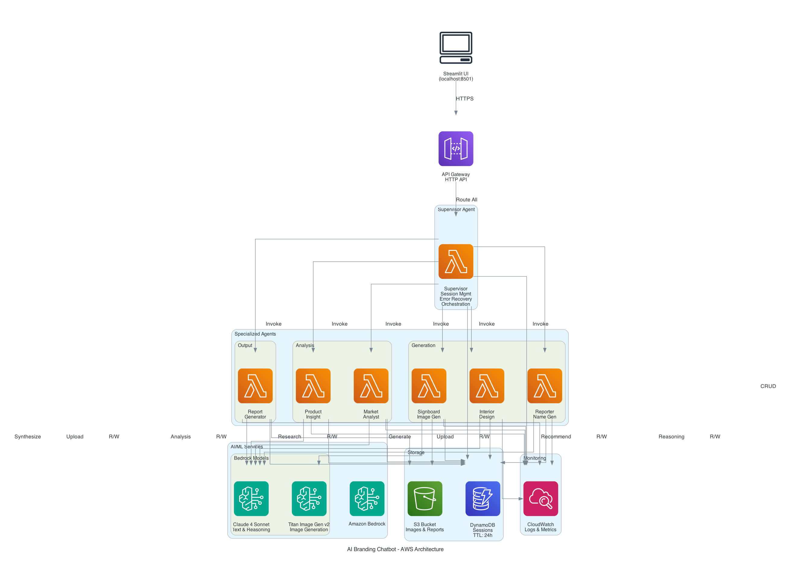
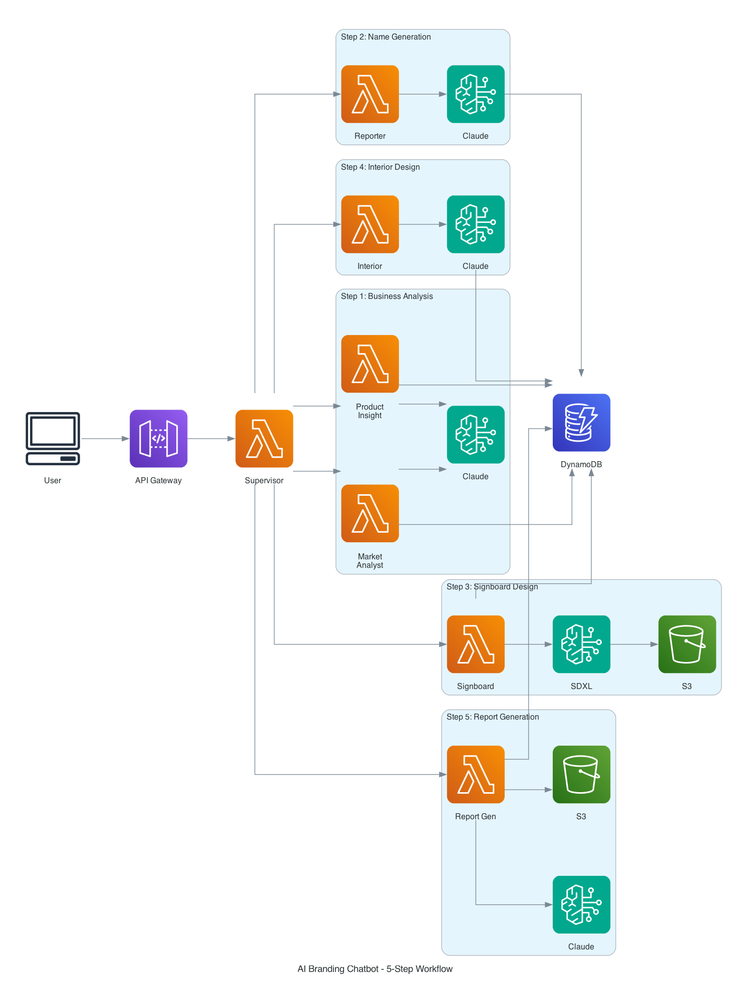
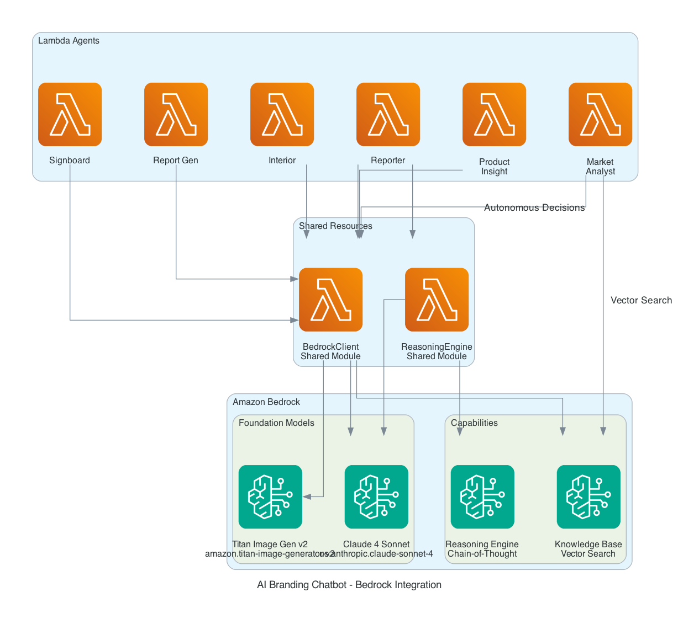

# AI Branding Chatbot - AWS Bedrock Implementation

An intelligent AI-powered branding system that generates comprehensive business branding materials through a 5-step automated workflow using Amazon Bedrock and serverless architecture.

## 🎯 Overview

This project automates the entire business branding process, from market analysis to final report generation, using AI agents powered by Amazon Bedrock. It generates:

- **Business Analysis** - Industry, region, and market insights
- **Business Names** - 3 AI-generated name suggestions with scoring
- **Signboard Designs** - AI-generated visual designs using Bedrock SDXL
- **Interior Recommendations** - 3 interior style options
- **Comprehensive Report** - HTML report with all branding materials

## 🏗️ Architecture

> 📊 **Visual Architecture Diagrams**: 
> - [AWS Infrastructure Diagram](docs/aws_architecture_diagram.png) - Complete system architecture
> - [5-Step Workflow Diagram](docs/workflow_sequence_diagram.png) - Workflow sequence
> - [Bedrock Integration Diagram](docs/bedrock_integration_diagram.png) - AI/ML integration
> - [Detailed Mermaid Diagrams](docs/architecture-diagram.md) - Interactive diagrams

### AWS Infrastructure Architecture



**Key Components:**
- **Streamlit UI**: Web interface running locally
- **API Gateway**: HTTP API for RESTful endpoints
- **Supervisor Agent**: Central orchestrator for session management, error recovery, and workflow coordination
- **6 Specialized Agents**: Product Insight, Market Analyst, Reporter, Signboard, Interior, Report Generator
- **Amazon Bedrock**: Claude 4 Sonnet for text/reasoning, Titan Image Generator v2 for images
- **DynamoDB**: Session state storage with 24-hour TTL
- **S3**: Asset storage for images and reports
- **CloudWatch**: Centralized logging and monitoring

### 5-Step Workflow



### Bedrock Integration



### High-Level Architecture

```
┌─────────────┐
│  Streamlit  │ Web Interface
│     UI      │
└──────┬──────┘
       │
       ▼
┌─────────────────────────────────────────┐
│         API Gateway (HTTP API)          │
└─────────────────────────────────────────┘
       │
       ├──────┬──────┬──────┬──────┬──────┬──────┐
       │      │      │      │      │      │      │
       ▼      ▼      ▼      ▼      ▼      ▼      ▼
    ┌────┐┌────┐┌────┐┌────┐┌────┐┌────┐┌────┐
    │PI  ││MA  ││REP ││SB  ││INT ││RG  ││SUP │
    │Agt ││Agt ││Agt ││Agt ││Agt ││Agt ││Agt │
    └─┬──┘└─┬──┘└─┬──┘└─┬──┘└─┬──┘└─┬──┘└─┬──┘
      │     │     │     │     │     │     │
      │     │     │     │     │     │     │ (Session Mgmt,
      │     │     │     │     │     │     │  Error Recovery,
      └─────┴─────┴─────┴─────┴─────┴─────┘  Orchestration)
                      │
       ├──────────────┼──────────────┐
       │              │              │
       ▼              ▼              ▼
┌──────────┐  ┌──────────┐  ┌──────────┐
│ Bedrock  │  │ DynamoDB │  │    S3    │
│Claude/   │  │ Sessions │  │  Assets  │
│  SDXL    │  │          │  │          │
└──────────┘  └──────────┘  └──────────┘

PI=Product Insight, MA=Market Analyst, REP=Reporter
SB=Signboard, INT=Interior, RG=Report Gen, SUP=Supervisor
```

### 5-Step Workflow

```
Step 1: Business Analysis
   ↓ (Product Insight + Market Analyst Agents)
   ↓ Uses: Bedrock Claude for analysis
   ↓
Step 2: Name Generation
   ↓ (Reporter Agent)
   ↓ Uses: Bedrock Claude for reasoning
   ↓
Step 3: Signboard Design
   ↓ (Signboard Agent)
   ↓ Uses: Bedrock SDXL for image generation
   ↓
Step 4: Interior Recommendations
   ↓ (Interior Agent)
   ↓ Uses: Bedrock Claude for recommendations
   ↓
Step 5: Report Generation
   ↓ (Report Generator Agent)
   ↓ Uses: Bedrock Claude for synthesis
   ↓
   ✓ Final HTML Report
```

## 🚀 Key Features

### AWS Bedrock Integration
- **Primary LLM**: Amazon Bedrock Claude 4 Sonnet for text generation and reasoning
- **Image Generation**: Amazon Bedrock SDXL (Titan Image Generator v2) for signboard designs
- **Reasoning Engine**: Chain-of-Thought reasoning for autonomous decision-making

### Agent-Based Architecture
- **6 Specialized Agents**: Each agent handles a specific task in the workflow
- **Supervisor Agent**: 
  - Session management (create, read, update sessions in DynamoDB)
  - API Gateway request routing and response handling
  - Autonomous error recovery with Reasoning LLM
  - Workflow orchestration via AgentCore (when enabled)
  - Structured logging and monitoring
- **Autonomous Execution**: Minimal user input required after initial setup

### Serverless Infrastructure
- **AWS SAM**: Infrastructure as Code for easy deployment
- **Lambda Functions**: Serverless compute for all agents
- **DynamoDB**: Session state management with TTL
- **S3**: Asset storage for images and reports
- **API Gateway**: RESTful HTTP API endpoints

## 📋 Prerequisites

- AWS Account with appropriate permissions
- AWS CLI configured (`aws configure`)
- AWS SAM CLI installed
- Python 3.9+
- Node.js 16+ (for Streamlit)

### Required AWS Permissions

Your IAM user/role needs:
- `bedrock:InvokeModel` - For Claude and SDXL
- `lambda:*` - For Lambda functions
- `dynamodb:*` - For session storage
- `s3:*` - For asset storage
- `apigateway:*` - For API Gateway
- `cloudformation:*` - For SAM deployment

### Bedrock Model Access

Enable these models in AWS Bedrock console (us-west-2):
1. **Anthropic Claude 4 Sonnet** (`us.anthropic.claude-sonnet-4-20250514-v1:0`)
2. **Amazon Titan Image Generator v2** (`amazon.titan-image-generator-v2:0`)

Check model access:
```bash
aws bedrock list-foundation-models --region us-west-2 --query 'modelSummaries[?contains(modelId, `claude`) || contains(modelId, `titan-image`)].modelId'
```

## 🛠️ Installation & Deployment

### 1. Clone Repository

```bash
git clone https://github.com/yourusername/ai-branding-chatbot.git
cd ai-branding-chatbot
```

### 2. Install Dependencies

```bash
# Create virtual environment
python3 -m venv venv
source venv/bin/activate  # On Windows: venv\Scripts\activate

# Install Python dependencies
pip install -r requirements.txt

# Install SAM CLI (if not installed)
brew install aws-sam-cli  # macOS
# Or follow: https://docs.aws.amazon.com/serverless-application-model/latest/developerguide/install-sam-cli.html
```

### 3. Configure Environment

```bash
# Copy environment template
cp .env.example .env

# Edit .env with your settings
# Required:
# - AWS_REGION=us-west-2
# - ENVIRONMENT=dev
```

### 4. Build and Deploy

```bash
# Build SAM application
sam build

# Deploy (first time - interactive)
sam deploy --guided

# Follow prompts:
# - Stack Name: ai-branding-chatbot-dev
# - AWS Region: us-west-2
# - Confirm changes: Y
# - Allow SAM CLI IAM role creation: Y
# - Save arguments to config: Y

# Subsequent deployments
sam deploy --config-env dev
```

### 5. Get API Endpoint

After deployment, note the API endpoint:
```bash
aws cloudformation describe-stacks \
  --stack-name ai-branding-chatbot-dev \
  --query 'Stacks[0].Outputs[?OutputKey==`ApiEndpoint`].OutputValue' \
  --output text
```

### 6. Run Streamlit UI

```bash
# Update API endpoint in .env
echo "API_BASE_URL=https://your-api-id.execute-api.us-west-2.amazonaws.com/dev" >> .env

# Run Streamlit
cd src/streamlit
streamlit run app.py
```

Access the UI at: http://localhost:8501

## 🎨 Regenerating Architecture Diagrams

To regenerate the architecture diagrams:

```bash
# Install diagram dependencies
python3 -m venv venv-diagram
source venv-diagram/bin/activate
pip install diagrams graphviz

# Generate diagrams
python3 scripts/generate_architecture_diagram.py

# Diagrams will be created in docs/ directory:
# - aws_architecture_diagram.png
# - workflow_sequence_diagram.png
# - bedrock_integration_diagram.png
```

## 📊 Project Structure

```
├── src/
│   ├── lambda/
│   │   ├── agents/                    # Agent Lambda functions
│   │   │   ├── supervisor/            # Workflow coordinator
│   │   │   ├── product-insight/       # Business analysis
│   │   │   ├── market-analyst/        # Market analysis
│   │   │   ├── reporter/              # Name generation
│   │   │   ├── signboard/             # Image generation
│   │   │   ├── interior/              # Interior recommendations
│   │   │   └── report-generator/      # Report generation
│   │   ├── shared/                    # Shared utilities (Lambda Layer)
│   │   │   ├── base_agent.py          # Base agent class
│   │   │   ├── bedrock_client.py      # Bedrock API client
│   │   │   ├── models.py              # Data models
│   │   │   └── utils.py               # Common utilities
│   │   └── layers/                    # Lambda layers
│   └── streamlit/                     # Web interface
│       └── app.py                     # Streamlit application
├── template.yaml                      # SAM template (IaC)
├── samconfig.toml                     # SAM deployment config
├── requirements.txt                   # Python dependencies
└── README.md                          # This file
```

## 🎮 Usage

### Via Streamlit UI

1. Open http://localhost:8501
2. Enter business information:
   - Industry (e.g., "Restaurant")
   - Region (e.g., "Seoul, Gangnam")
   - Size (e.g., "Small (1-10 employees)")
3. Click "Start Analysis"
4. Follow the 5-step workflow
5. Download final report

### Via API

#### Create Session
```bash
curl -X POST https://your-api-id.execute-api.us-west-2.amazonaws.com/dev/sessions \
  -H "Content-Type: application/json" \
  -d '{
    "industry": "Restaurant",
    "region": "Seoul, Gangnam",
    "size": "Small"
  }'
```

#### Get Session Status
```bash
curl https://your-api-id.execute-api.us-west-2.amazonaws.com/dev/sessions/{sessionId}
```

#### Generate Business Names
```bash
curl -X POST https://your-api-id.execute-api.us-west-2.amazonaws.com/dev/names/suggest \
  -H "Content-Type: application/json" \
  -d '{
    "sessionId": "your-session-id",
    "businessInfo": {...}
  }'
```

## 🧪 Testing

### Integration Tests

```bash
# Run all integration tests
python -m pytest tests/integration/ -v

# Run specific test
python -m pytest tests/integration/test_workflow.py -v
```

### Manual Testing

```bash
# Test Bedrock access
aws bedrock-runtime invoke-model \
  --model-id us.anthropic.claude-sonnet-4-20250514-v1:0 \
  --body '{"prompt":"Hello","max_tokens":100}' \
  --region us-west-2 \
  output.json

# Test API endpoint
curl https://your-api-id.execute-api.us-west-2.amazonaws.com/dev/
```

## 📈 Monitoring

### CloudWatch Logs

```bash
# Supervisor Agent logs
aws logs tail /aws/lambda/ai-branding-chatbot-supervisor-agent-dev --follow

# All agent logs
aws logs tail /aws/lambda/ai-branding-chatbot --follow
```

### DynamoDB Sessions

```bash
# List recent sessions
aws dynamodb scan \
  --table-name ai-branding-chatbot-sessions \
  --max-items 5 \
  --region us-west-2
```

### S3 Assets

```bash
# List generated assets
aws s3 ls s3://ai-branding-chatbot-dev-brandingassetsbucket-xxxxx/ --recursive
```

## 💰 Cost Estimation

Approximate costs per workflow execution:

- **Bedrock Claude**: ~$0.015 per request (5 requests) = $0.075
- **Bedrock SDXL**: ~$0.04 per image (3 images) = $0.12
- **Lambda**: ~$0.0001 per invocation (7 invocations) = $0.0007
- **DynamoDB**: ~$0.0001 per request = $0.0001
- **S3**: ~$0.001 per GB = $0.001
- **API Gateway**: ~$0.001 per request = $0.001

**Total per workflow**: ~$0.20

## 🔧 Configuration

### Environment Variables

Key environment variables in `template.yaml`:

```yaml
BEDROCK_REGION: us-west-2
CLAUDE_MODEL_ID: us.anthropic.claude-sonnet-4-20250514-v1:0
SDXL_MODEL_ID: amazon.titan-image-generator-v2:0
ENABLE_FALLBACK: false  # Bedrock-only mode
ENVIRONMENT: dev
```

### Customization

- **Timeout**: Adjust Lambda timeout in `template.yaml`
- **Memory**: Adjust Lambda memory in `template.yaml`
- **TTL**: Adjust DynamoDB TTL (default: 24 hours)
- **Prompts**: Customize prompts in each agent's code

## 🐛 Troubleshooting

### Bedrock Access Denied

```bash
# Check IAM permissions
aws iam get-user
aws iam list-attached-user-policies --user-name your-username

# Enable Bedrock models in console
# https://console.aws.amazon.com/bedrock/home?region=us-west-2#/modelaccess
```

### Lambda Timeout

- Increase timeout in `template.yaml`
- Check CloudWatch logs for specific errors
- Verify Bedrock API latency

### DynamoDB Throttling

- Check CloudWatch metrics
- Consider increasing provisioned capacity
- Use exponential backoff in code

## 📝 License

MIT License - see [LICENSE](LICENSE) file for details

## 🤝 Contributing

Contributions welcome! Please:
1. Fork the repository
2. Create a feature branch
3. Make your changes
4. Submit a pull request

## 📧 Contact

- **Project**: AI Branding Chatbot
- **Author**: Your Name
- **Email**: your.email@example.com
- **GitHub**: https://github.com/yourusername/ai-branding-chatbot

## 🏆 AWS AI Agent Global Hackathon

This project was built for the AWS AI Agent Global Hackathon 2025.

### Key Technologies
- Amazon Bedrock (Claude 4 Sonnet, SDXL)
- AWS Lambda (Serverless)
- AWS SAM (Infrastructure as Code)
- DynamoDB (Session Management)
- S3 (Asset Storage)
- API Gateway (HTTP API)

### Hackathon Requirements Met
- ✅ Amazon Bedrock as primary LLM provider
- ✅ Agent-based architecture (6 specialized agents)
- ✅ Autonomous task execution
- ✅ External tool integration (DynamoDB, S3)
- ✅ Reproducible deployment (SAM)
- ✅ Comprehensive documentation

---

**Built with ❤️ using Amazon Bedrock and AWS Serverless**
